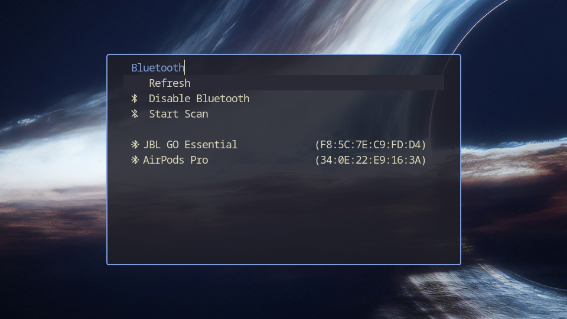
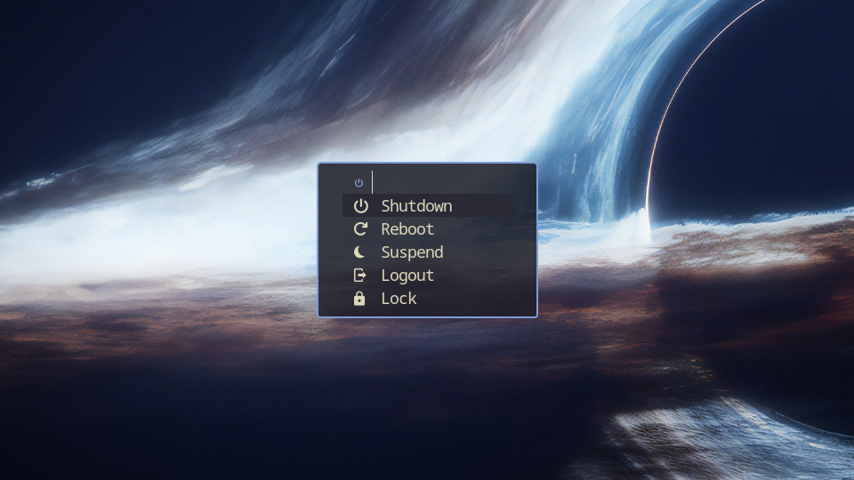
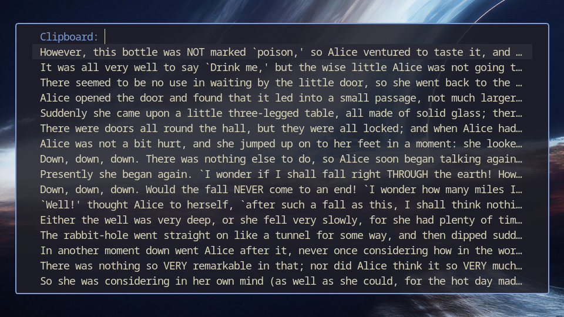
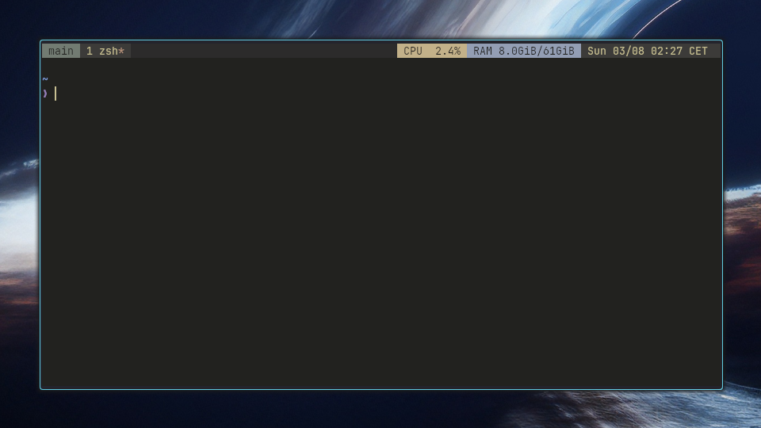
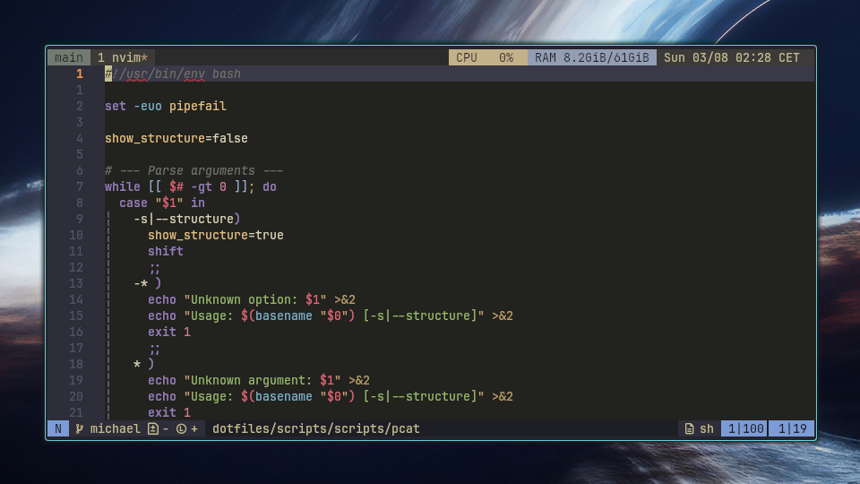

# My Dotfiles

These are my personal dotfiles designed for Arch Linux.

## Setup

Clone the repository:

```bash
git clone https://github.com/gaajj/dotfiles ~/dotfiles
```

Then stow all configs into `$HOME`:

```bash
stow */
```

Or stow just the configs you want:

```bash
stow nvim zsh
```

(or manually link the directories if you dont use stow)

```bash
ln -s ~dotfiles/nvim/.config/nvim ~/.config/nvim
```

## Notes

- Terminal stack: `Hyprland -> Kitty -> tmux -> zsh`

## Previews

### Fuzzel Menus





### Tmux



### NeoVim


